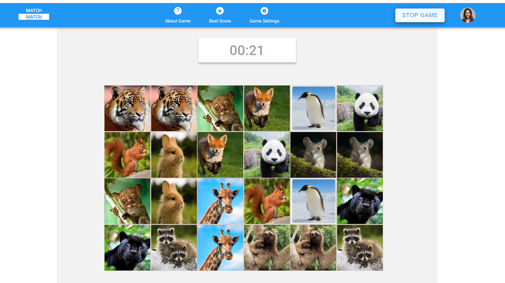

# match-match-game
Game match-match

## Deploy

[Demo match-match-game](https://tsepulya-match-match-game.netlify.app)



## Description

It`s a memory game, helps to improve your memory

## How to play

At the page 'About Game' you can see the description, how to play.
1. You should be registered as a new player in game (also you can add an avatar)
2. Configure your game settings at the page 'Game Settings' - difficulty and type of cards
3. Push the button 'Start Game'

## Installation

$ npm install
```

## Running the app
